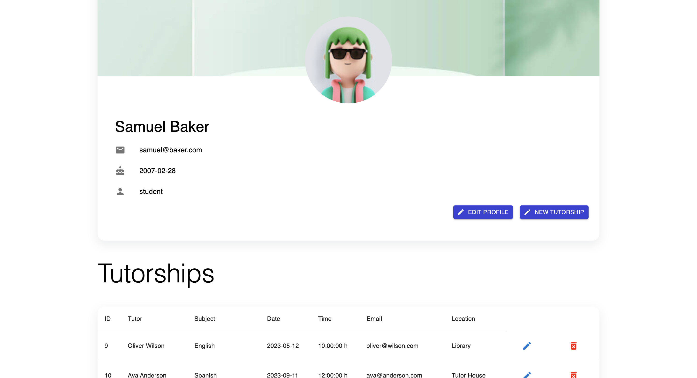
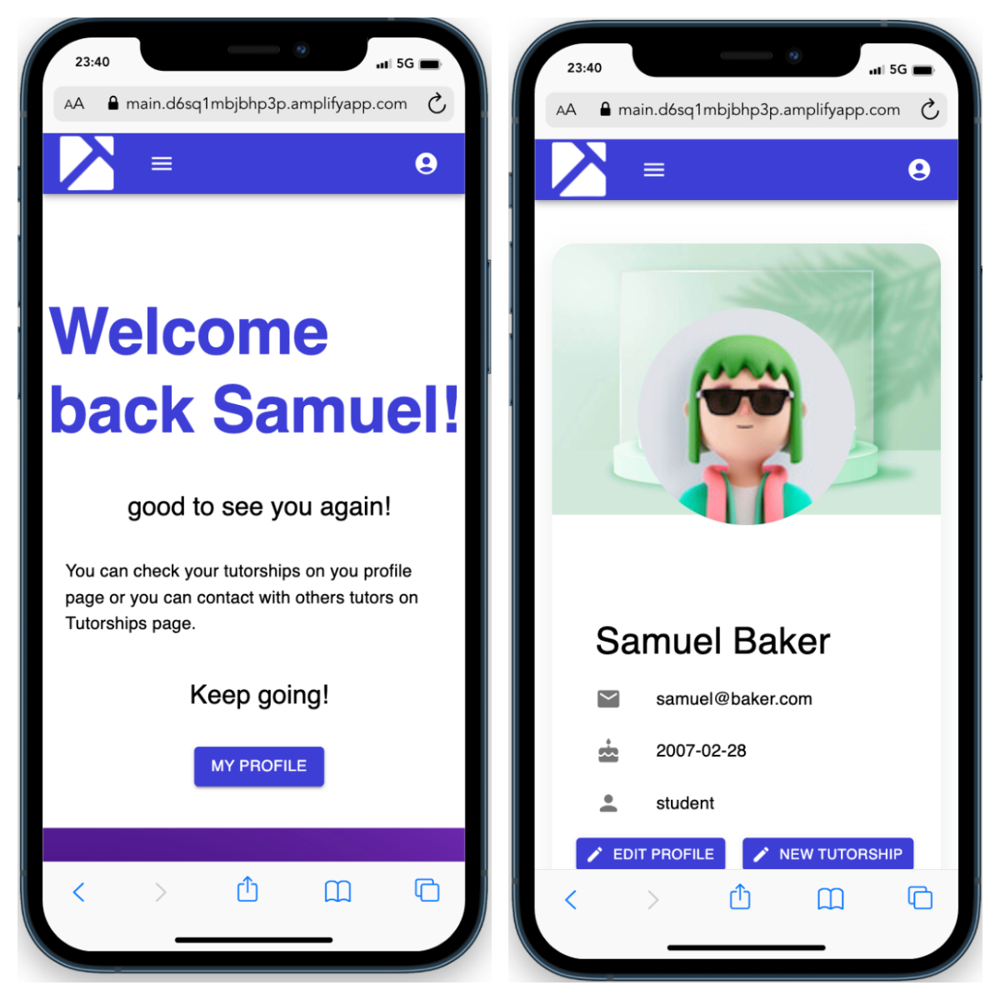
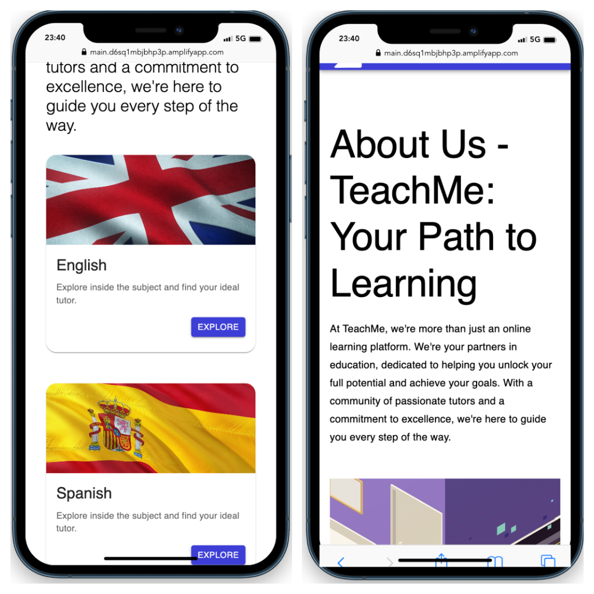

# TeachME website - Learn and enjoy at same time

  
Contenido 📝

  <ol>
    <li><a href="#objetivo-🎯">Objetivo</a></li>
    <li><a href="#acerca-de-este-proyecto-🔎">Acerca de este proyecto</a></li>
    <li><a href="#stack">Stack</a></li>
    <li><a href="#deploy">Deploy TeachMe</a></li>
    <li><a href="#instalación-en-local">Instalación</a></li>
    <li><a href="#vistas">Vistas</a></li>
    <li><a href="#credenciales">Credenciales</a></li>
    <li><a href="#futuras-funcionalidades">Futuras funcionalidades</a></li>
    <li><a href="#webgrafia">Webgrafia</a></li>
    <li><a href="#contacto">Contacto</a></li>
  </ol>

## Objetivo 🎯

El objetivo es reducir el fracaso escolar, ayudando a los jóvenes con éste problema.

Busco crear un portal en el que tanto estudiantes de cursos superiores puedan sacar un
dinero extra, como los estudiantes de cursos menores puedan ver de nuevo lo que no
han podido aprender en las aulas o reforzar lo ya aprendido.

## Acerca de este proyecto 🔎

Es una aplicación dedicada a contactar a alumnos que necesiten o quieran dar
clases particulares. Está enfocada tanto para aquellos alumnos que necesitan a un
profesor particular como aquellos estudiantes que se quieren sacar un dinero extra.
Una vez que se inicie la sesión de usuario podrá seleccionar su rol de profesor o
alumno. Dentro podrás colgar tu oferta de clases y otros alumnos podrán verla para
poder contactar contigo.

## Stack

 

## Deploy TeachMe APP

<a href="https://main.d6sq1mbjbhp3p.amplifyapp.com/" target="_blank"/>TeachME WebSite</a>

## Instalación en local

- <a href="https://github.com/Stevengs7/Final-Project-BackEnd" target="_blank">Enlace al BackEnd<a>

1. Clonar el repositorio
2. `$ npm install`
3. `$ npm run dev`

## 💻 Vistas Escritorio

Home

Register

Login

Patient profile

## 📱 Vistas mobile

Home / Profile

Subjects / About

## Credenciales

Credenciales

- AUTH

- Contraseña para todos los usuarios

      12345678

- Como Student

      samuel@baker.com

- Como Tutor

      oliver@wilson.com

</datails>

## Futuras funcionalidades

✅ Buscar tutorias por tutor y no por asignatura. 
⬜ Actualizar las tutorias como estudiente y tutor. 
⬜ ...

## Webgrafia:

- https://mui.com/material-ui/getting-started/

## Contacto

